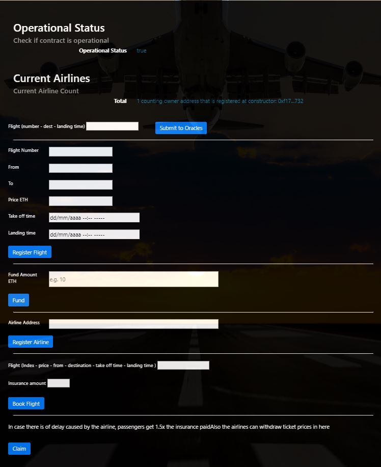

# FlightSurety
Contracts, Dapp and server App to allow an user buys insurance for a certain flight and gets 1.5X in case flight is delayed due to an airline complication

# Frameworks and technologies used
* Ethereum
* Solidity 4
* Ganache CLI
* Truffle
* Mocha JS
* NodeJS

# Installation
### Install packages
```
npm install
```

### Run ganache and create 50 accounts (this seed was used in testing)
```
ganache-cli -m "candy maple cake sugar pudding cream honey rich smooth crumble sweet treat" -a 50
```

### Compile contracts
```
truffle compile
```

### Test contracts
NOTE: All testing was made using DAPP UI to provide a more realistic approach as rubric and project walkthrough allow, specially to provide an environment to test Oracle funcationallity using server express app

### Migrate contracts
```
truffle migrate
```

### Run UI DAPP
```
npm run dapp
```

### Run Server (oracles)
```
npm run dapp
```

### How to test
Before begin
Make sure MetaMask is running and connected to Ganache CLI localhost:8545

1. Run ganache blockchain
2. Compile and migrate contracts
3. Run UI DAPP
4. Run Server
5. Since a airline is registered at deployment, fund airline with 10 ETH
6. Register a new flight and refresh page to fill input fields with registered flights
7. Change to another address using MetaMask (although there's extra code to detect the new address without page refreshing, i recommend to refresh)
8. Buy insurance (for example 0.5)
9. Submit oracle request
10. Change to appropriate addresses and claim ETH

## IMPORTANT NOTE
In server.js there's a change to allow faster checking for insurance payment, setting fixed oracle responses to code 20 (due to airline)
```const statusCode = 20; //(Math.floor(Math.random() * 5) + 1) * 10 ```
This can be changed to adjust to a more realistic approach

# Screenshoots



